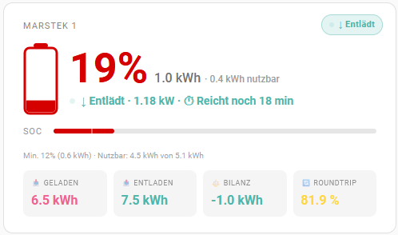
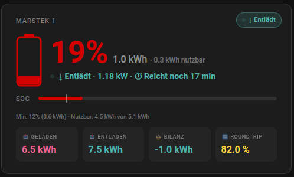

# Battery Storage Card

A custom Home Assistant Lovelace card for monitoring home battery storage systems.
Works with any battery system that exposes sensors to Home Assistant (SMA, Fronius, Huawei, Sonnen, E3DC, Growatt, Marstek, Alpha ESS, and more).


## Preview

| Light Mode | Dark Mode |
|:---:|:---:|
|  |  |

## Features

- 🔋 **SOC display** – large percentage with stored kWh and usable kWh
- ⚡ **Power monitoring** – charge/discharge power with estimated time remaining
- 🏥 **SOH bar** – state of health with color-coded indicator
- 📊 **SOC bar** – visual fill level with configurable minimum SOC marker
- 🔋 **Battery icon** – animated SVG icon reflecting current fill level and color
- 🏷️ **Status badge** – charging / discharging / idle indicator (top right corner)
- 📥 **Daily energy tiles** – charged / discharged / balance for today
- 🔄 **Roundtrip efficiency** – calculated from lifetime totals
- 🎨 **Customizable colors** – separate color pickers for charging and discharging states
- ⬇️ **Minimum SOC** – configurable depth of discharge with visual bar marker
- 🔁 **Invert support** – for sensors where positive = discharging
- 🌍 **Auto language** – German / English based on HA language setting
- 📱 **Responsive layout** – optimized for both desktop and smartphone
- 🖱️ **Full GUI editor** – all options configurable without YAML

## Installation

### HACS (recommended)

[](https://my.home-assistant.io/redirect/hacs_repository/?owner=weskona&repository=battery-storage-card&category=lovelace)

Or manually:

1. Open HACS in Home Assistant
2. Go to **Frontend**
3. Click the three dots menu → **Custom repositories**
4. Add `https://github.com/YOUR_USERNAME/battery-storage-card` as **Lovelace**
5. Install **Battery Storage Card**
6. Reload your browser

### Manual

1. Download `battery-storage-card.js`
2. Copy it to `/config/www/community/battery-storage-card/`
3. Go to **Settings → Dashboards → Resources**
4. Add `/local/community/battery-storage-card/battery-storage-card.js` as **JavaScript module**
5. Reload your browser

## Configuration

Add the card via the UI editor or manually in YAML:

```yaml
type: custom:battery-storage-card
title: Battery Storage
soc_entity: sensor.battery_soc
capacity_kwh: 10
min_soc: 10
power_entity: sensor.battery_power
power_invert: false
soh_entity: sensor.battery_soh
energy_in_entity: sensor.battery_energy_charged_today
energy_out_entity: sensor.battery_energy_discharged_today
energy_in_total_entity: sensor.battery_energy_charged_total
energy_out_total_entity: sensor.battery_energy_discharged_total
color_charging: "#f06292"
color_discharging: "#4db6ac"
show_soh: true
show_daily_energy: true
```

## Options

| Option | Type | Default | Description |
|--------|------|---------|-------------|
| `title` | string | `Battery Storage` | Card title |
| `soc_entity` | entity | **required** | State of charge sensor (%) |
| `capacity_kwh` | number | — | Total battery capacity in kWh |
| `min_soc` | number | — | Minimum SOC / depth of discharge (%) |
| `power_entity` | entity | — | Combined charge/discharge power sensor (W) |
| `power_invert` | boolean | `false` | Invert power sign (positive = discharging) |
| `soh_entity` | entity | — | State of health sensor (%) |
| `energy_in_entity` | entity | — | Energy charged today (kWh) |
| `energy_out_entity` | entity | — | Energy discharged today (kWh) |
| `energy_in_total_entity` | entity | — | Total energy charged lifetime (kWh) |
| `energy_out_total_entity` | entity | — | Total energy discharged lifetime (kWh) |
| `color_charging` | color | `#f06292` | Color for charging state |
| `color_discharging` | color | `#4db6ac` | Color for discharging state |
| `show_soh` | boolean | `true` | Show/hide SOH bar |
| `show_daily_energy` | boolean | `true` | Show/hide daily energy tiles and roundtrip |

## Power Sensor

The card uses a single combined power sensor:
- **Positive value** = charging (default)
- **Negative value** = discharging (default)

If your sensor uses the opposite convention, enable **Invert** in the UI editor or set `power_invert: true`.

## Roundtrip Efficiency

Calculated from lifetime totals:

```
roundtrip = energy_out_total / energy_in_total × 100 %
```

Requires `energy_in_total_entity` and `energy_out_total_entity` to be configured.

## Language

The card automatically uses the language set in your Home Assistant profile:
- 🇩🇪 German (`de`)
- 🇬🇧 English (all other languages)

## License

MIT
